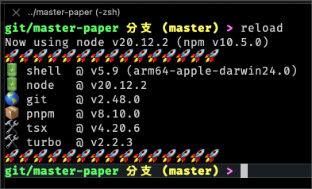

# 🤣 oh-my-typescript-zsh

## Usage

> [!TIP]
>
> choose a tool that can run `*.ts` files, such as [tsx](https://www.npmjs.com/package/tsx)

```sh
pnpm i tsx -g
```

---

> [!TIP]
>
> git clone this repo into your local machine

```sh
cd ~/git # for me, I would place any git projects in this directory

git clone git@github.com:aqzhyi/oh-my-typescript-zsh.git # clone this repo

la ~/git/oh-my-typescript-zsh # make sure the project is cloned successfully
```

---

> [!TIP]
>
> edit the `~/.zshrc` file

```sh
vi /Users/{username}/.zshrc
```

---

> [!TIP]
>
> add the following content at the bottom of the file

```sh
tsx /Users/{username}/git/oh-my-typescript-zsh/src/templates/showGlobalPackagesVersion.ts
```

---

> [!TIP]
>
> reload zsh shell

```sh
source ~/.zshrc
```


